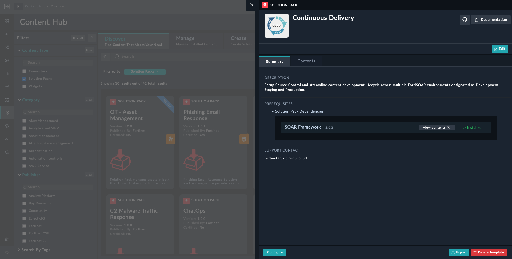
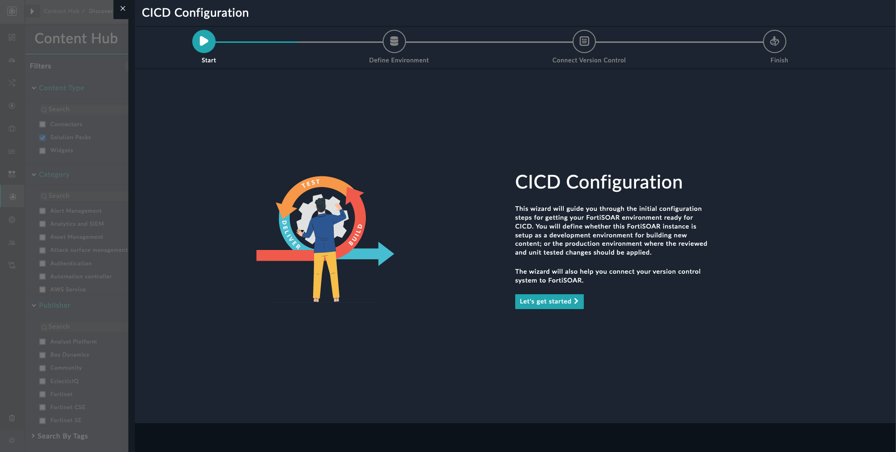
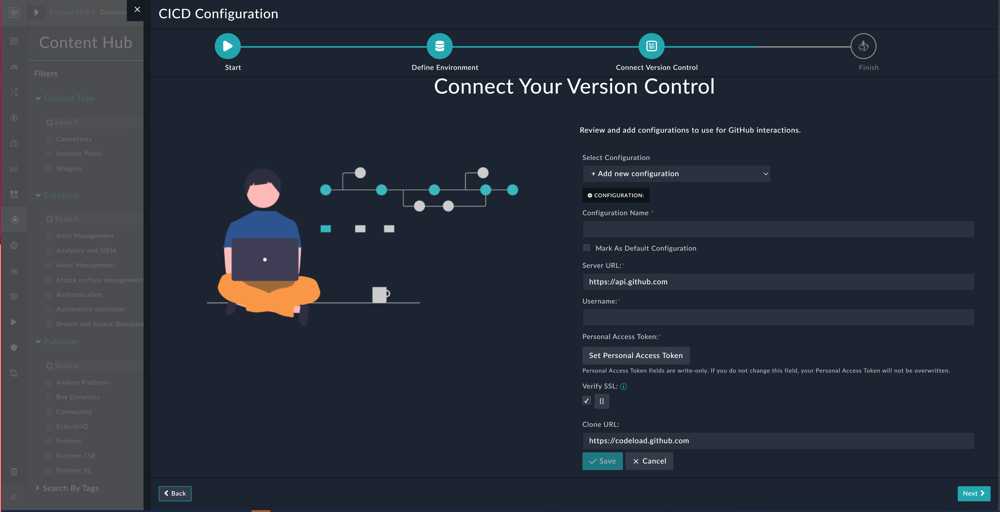
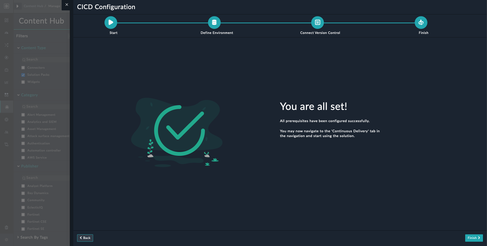

# Installation

1. To install this solution pack, click **Content Hub** > **Discover**.

2. From the list of solution packs that appear, search for **Continuous Delivery** solution pack.

3. Click the **Continuous Delivery** solution pack card.

4. Click the **Install** button on the lower-left to begin the installation.

## Prerequisites

**Continuous Delivery** has no dependency on any of the solution packs. However, it has following prerequisites:

1. **Organizational account**: A GitHub organization account is a type of account that represents an organization, instead of an individual user. It allows multiple users to collaborate on projects and manage access to repositories and teams.

    Refer to this article to know more about [types of GitHub Accounts](https://docs.github.com/en/get-started/learning-about-github/types-of-github-accounts#organization-accounts).

2. **GitHub User Account**: Users must have their GitHub accounts. You can then use their usernames to invite them to your organization.

    Refer to this article to know more about [creating accounts for people in your organization](https://docs.github.com/en/organizations/managing-membership-in-your-organization/can-i-create-accounts-for-people-in-my-organization#adding-users-to-your-organization).

3. **GitHub User Roles**: To use the wizard for setting up source control and creating repositories through playbooks, FortiSOAR admin must have appropriate rights to create repositories on GitHub.

    Refer to this article to know more about [assigning roles and permissions on GitHub](https://docs.github.com/en/organizations/managing-user-access-to-your-organizations-repositories/repository-roles-for-an-organization#permissions-for-each-role).

    >**NOTE**: If the production FortiSOAR instance is separate from the development FortiSOAR instance, the content developers working in development environment must also be added in production FortiSOAR instance, and their GitHub usernames be appropriately mapped in connector configurations.

4. **GitHub Repositories**: FortiSOAR's **Continuous Delivery** creates repositories for you during the setup process. Alternatively, you may prefer to map existing repositories with this solution pack.

    For mapping repositories with content changes on the FortiSOAR instance, there must be the following three repositories:
    1. **Content repository**: Production content, dev content, staging and test changes reside on the *same* repository. To avoid accidental merges and conflicts, it is recommended that this branch be protected by using pull requests to merge developmental changes

    2. **Production Settings Repository**: Production settings containing system views (e.g. Navigation Menu structure), application configuration, environment variables, account configuration, LDAP, SSO, and RADIUS configuration of a production environment are saved to this repository. Development environment must not have access to this repository as it uses production configurations and information.

    3. **Development Settings Repository**: Development settings containing system views, application configuration, environment variables, account configuration, LDAP, SSO, and RADIUS configuration of a development environment are backed up or synced on this repository.

        > **NOTE**: GitHub users who are setting up production environment in Continuous Delivery and creating repositories, must have permissions to create private repositories on GitHub. For more information, refer to [Restricting repository creation in your organization](https://docs.github.com/en/organizations/managing-organization-settings/restricting-repository-creation-in-your-organization).

# Configurations

This section details the required configurations for optimal performance of the **Continuous Delivery** solution pack.

- A source control connector for tracking and managing changes to code:

    - To configure and use the GitHub connector to track and manage changes through GitHub, refer to [Configuring GitHub](https://docs.fortinet.com/document/fortisoar/1.0.0/github/344/github-v1-0-0#Configuration_parameters).

>**NOTE**: FortiSOAR users directly interacting with GitHub must be appropriately mapped with corresponding usernames in their GitHub connector configurations.

## Setup Continuous Delivery on FortiSOAR

After installation of **Continuous Delivery** solution pack, run the configuration wizard to ready your FortiSOAR environment for (CI/CD). This wizard helps you connect your FortiSOAR development and production environments to a source control.

1. Log in to FortiSOAR and [after installation](#installation), click the button **Configure** from the lower-left of the screen.

    

2. Click the button **Let's get started** on the CICD configuration page.

    

3. Specify whether you want the FortiSOAR instance to be a production environment or development environment and click **Next**.

    

4. Add configuration information for setting up GitHub interactions. You can set up multiple configurations for multiple users interacting with GitHub. Click **Next** to proceed.

    

    >**NOTE**: Select **+Add New Configuration** from the *Select Configuration* field to setup a new configuration.

5. Click **Finish** to complete the configuration process.

    

## Setup Source Control for Production Environment

You can setup GitHub as a source control management through playbooks, automatically, or by pre-creating repositories on GitHub and linking them to FortiSOAR Continuous Delivery solution pack.
To setup GitHub as a source control and creating repositories using playbooks:

1. Select **Continuous Delivery** from the FortiSOAR menu.

2. Click the button **Setup Source Control** under the **Setup** tab’s **Setup the Source Control for Production Environment** section.

3. Click the button **Setup Prod Environment** from the lower left part of the screen.

4. Enter the GitHub username with which to map the username you used to log in to FortiSOAR.

5. Enter the GitHub Source Control details:

    

    1. Enter the Organization’s name as created on GitHub.

    2. Enter the repository names to be created under the specified organization. To accept the auto-populated suggested name, leave the fields as-is.

    3. Enter the Base Branch Name to be created under the specified repositories. To accept the auto-populated suggested name, leave the field as-is.

    4. Click Setup to proceed.

    5. Click the button Create Repositories to let the playbooks automatically create the repo (repository) and the specified branch in each repo.

        1. Click the button I have the repositories if you have already created the repositories, with the exact same names as specified in the earlier step, on GitHub.

        2. Click the button Confirm, after creating the repositories, for FortiSOAR to check if the specified repositories exist.

    6. Click the button Push to push the content from FortiSOAR to the specified branch of the repository mentioned in Production Content.
    Pushing overwrites the contents of the repository mentioned in Production Content. You can click the button Skip to push the contents later.

## Setup Development Environment

Once you have setup source control for production environment, move over to the development FortiSOAR instance to initiate the setup for development environment. This action aims to keep dev changes under the purview of source control.

1. Select **Continuous Delivery** from the FortiSOAR menu.

2. Click the button **Setup Source Control** under the **Setup** tab’s **Setup the Source Control for Development Environment** section.

3. Click the button **Setup Dev Environment** from the lower left part of the screen.

4. Enter the GitHub username with which to map the username you used to log in to FortiSOAR.
